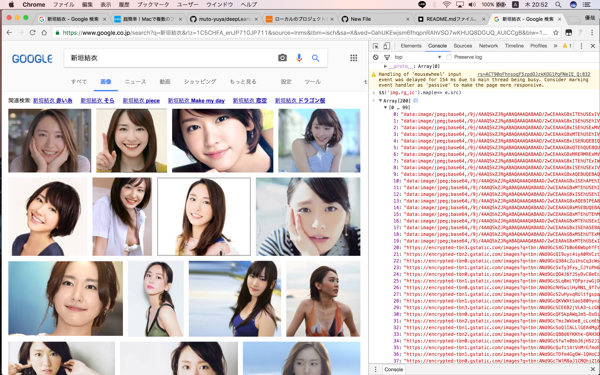

# deepLearning

### 使い方
####オリジナル画像でない時
1. google画像検索で画像を検索
2. 検証のコンソールで`$$('img.rg_ic').map(e=> e.src)`と入力。(この時撮りたい画像のぶんだけ下にスクロールしておく。)　

3. 表示されたurlをクリップボードにコピーして、input.txtに貼り付け。(形式はinput.txtにもともとあるやつを参考、上書きする。)
4. download.pyのfirst_numberを指定してdownload.pyを実行するとダウンロードできる。

####オリジナル画像がほしいとき
1. google画像検索で画像を検索
2. 検証のコンソールで`$$('#rg_s > div > a').map(e=> e.href)`と入力。(この時撮りたい画像のぶんだけ下にスクロールしておく。)　
3. 表示されたurlをクリップボードにコピーして、input.txtに貼り付け。(形式はinput.txtにもともとあるやつを参考、上書きする。)
4. seleniumDownload.pyのfirst_number,person_nameを指定してSeleniumDownload.pyを実行するとダウンロードできる。

###注意
input.txt,output.txtはgit管理に含めない。
完全自動化できなくてごめんね。
seleniumDownloadは割とエラーはきます。10分おきくらいにチェックしてください。
